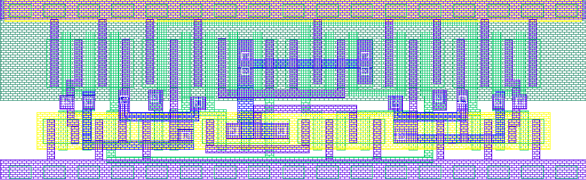
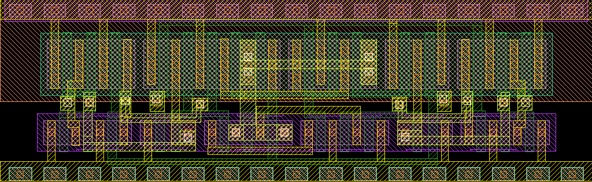

# gf180mcu_gp9t3v3__comp2_2

- Description: 1-bit Comparator 2x Drive
- PDK: gf180mcuD

## Authorship

- Designer: User
- Company: Symbelleuit
- Created: 2025-11-22
- License: Apache 2.0
- Last modified: None

## Pins

- VDD
  + Description: Power supply
  + Type: power
  + Direction: inout
- VSS
  + Description: Ground
  + Type: ground
  + Direction: inout
- A
  + Description: Input A
  + Type: signal
  + Direction: input
- B
  + Description: Input B
  + Type: signal
  + Direction: input
- L
  + Description: Output L (A < B)
  + Type: signal
  + Direction: output
- E
  + Description: Output E (A = B)
  + Type: signal
  + Direction: output
- G
  + Description: Output G (A > B)
  + Type: signal
  + Direction: output

## Default Conditions

- vdd
  + Description: Power supply voltage
  + Display: VDD
  + Unit: V
  + Typical: 3.3
- temperature
  + Description: Ambient temperature
  + Display: Temp
  + Unit: °C
  + Typical: 27
- corner
  + Description: Process corner
  + Display: Corner
  + Typical: typical

## Symbol

## Schematic

## Layout

